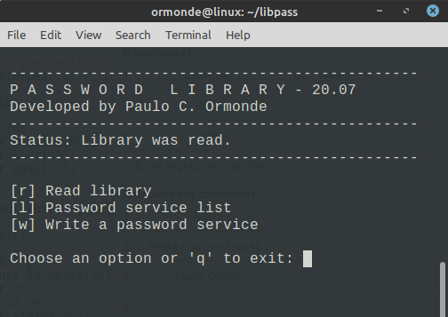
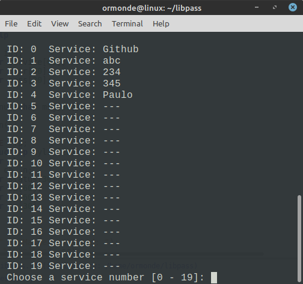
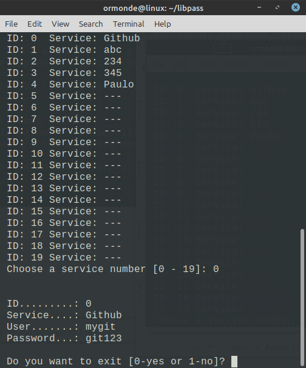
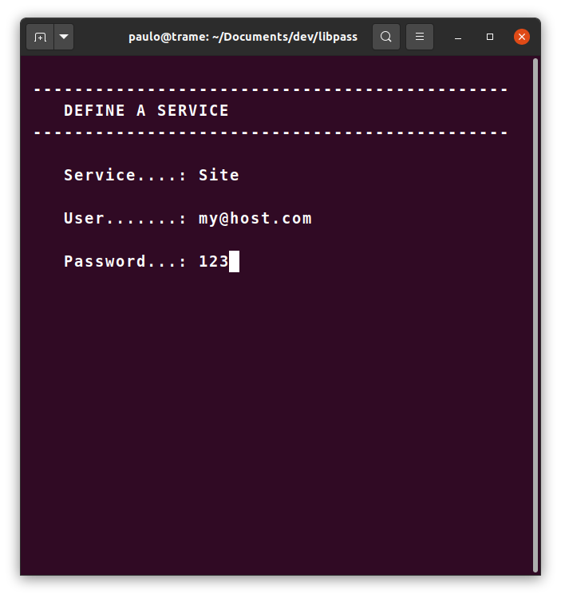

# LIBPASS 21.02 - Password Library

  

## 1. About this software

The purpose of this software is to offer a simple, portable and secure alternative to store passwords for on-line services, such as social media accounts and email. Each person can compile the code written in **pure C** or use the binary file for **GNU/Linux**. The default password is **123**, which you can redefine by the **'d'** option from the first menu. The new password that you define will be written in the file **lic.sha** as a sha256sum hash (included in GNU Core Utilities). Your data will be stored in the **libpass.dat** binary file and you don't just forget your main password. 

> Very simple software but trustworthy 

## 2. Development Language

This project is develop in pure C language and compiled in [GCC 7.5](https://gcc.gnu.org/). This version was tested in **GNU/Linux** OS.

## 3. Task List

- [x] Concept
- [x] Basic code that works
- [x] Githup repository
- [ ] No limits for services register
- [x] Cryptography

## 4. Screenshots and instructions

Start the program typing **./libpass** into the directory **[libpass]**. At the start, the program will read the file **libpass.dat**. If the file does not exist, the program will ask you to create a new library file.

The **'l'** option from the main menu will list the 20 services and their ID number. 

Choose a number between 0 and 19 to see the content of a particular register. 

The **'a'** option from the main menu and with a ID number you can write over a register.

---

## 5. License

[MIT](https://opensource.org/licenses/MIT)

[Click here to see the LICENSE](LICENSE)

 

