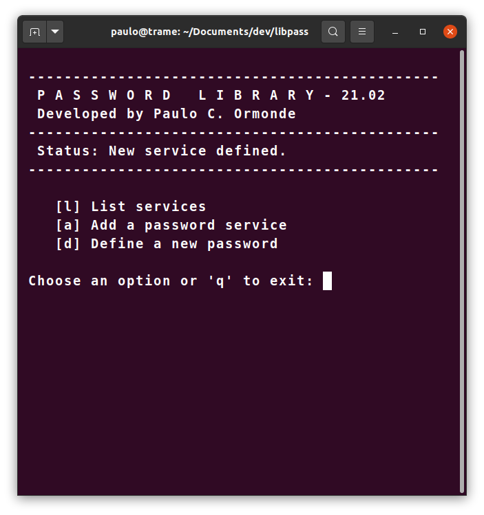
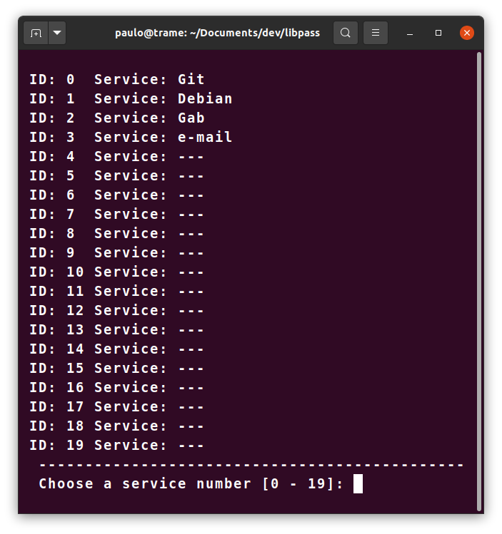
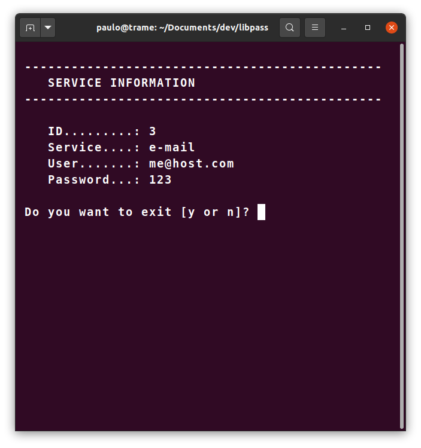

# PASSWORD LIBRARY

  

## 1. About this software

The purpose of this software is to offer a simple, portable and secure alternative to store passwords for on-line services, such as social media accounts and email. Each person can compile the code written in pure C, changing the main password that will give you access to all the other passwords you define. Your data will be stored in the **libpass.dat** binary file.

At line 6 you can change the masterpass value. 

```c
5 /* define your master password before compile */
6 char masterpass[6] = "abc123"; 
```

> Very simple software but trustworthy 

## 2. Development Language

This project is develop in pure C language and compiled in [GCC 7.5](https://gcc.gnu.org/). This version was tested in Linux OS.

## 3. Task List

- [x] Concept
- [x] Basic code that works
- [x] Githup repository
- [ ] No limits for services register
- [ ] Cryptography
- [ ] Search engine
- [ ] Github blog and tutorial

## 4. Screenshots and instructions

The first step to start the program is read the file **libpass.dat** by choosing the **r **option from the main menu. If the file does not exist, the program will ask you to create a new library file.

The **l** option from the main menu will list the 20 services and their ID number. 




Choose a number between 0 and 19 to see the content of a particular register. 




The **w** option from the main menu and with a ID number you can write over a register.


---

## 5. License

[MIT](https://opensource.org/licenses/MIT)

[Click here to see the LICENSE](LICENSE)


 


